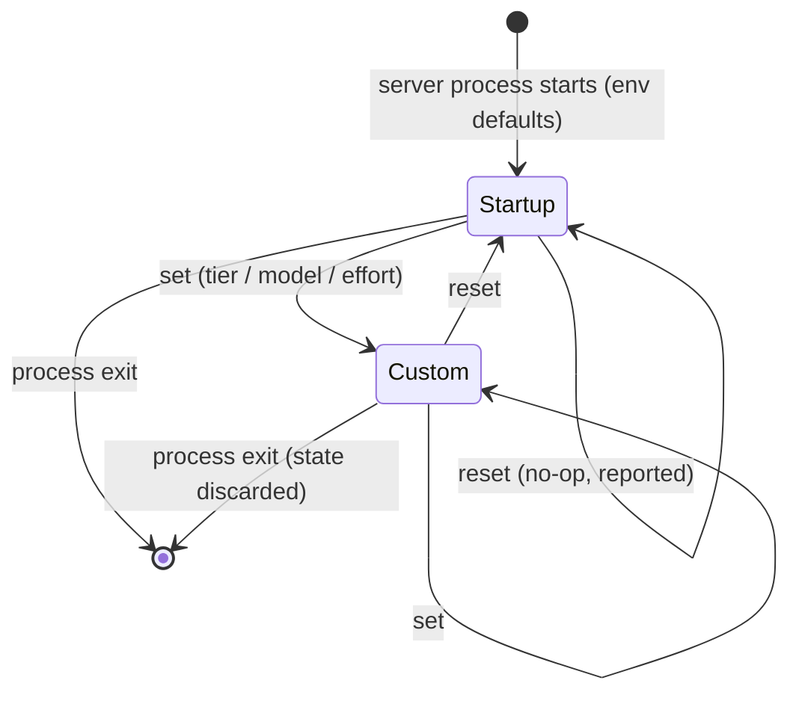
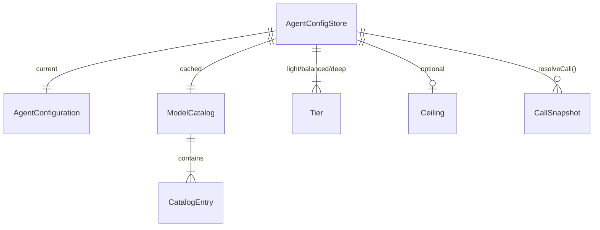

# Data Model: Agent Model & Reasoning-Effort Control

**Feature**: `specs/005-agent-model-effort-control` | **Date**: 2026-10-05

All state lives **in memory, per server process** (FR-018). Nothing is written to disk. Each server process (Antigravity, Codex) owns exactly one `AgentConfigStore`.

---

## EffortLevel

A closed, ordered vocabulary shared by both agents (research R4).

| Value | Rank | Notes |
|-------|------|-------|
| `low` | 0 | |
| `medium` | 1 | |
| `high` | 2 | |
| `xhigh` | 3 | |
| `max` | 4 | |
| `ultra` | 5 | Native to Codex only; never used by built-in tiers; applying it adds a warning |

**Mapping** `mapEffort(requested, supported[]) → { effort, mappedFrom? }`:
1. If `requested ∈ supported`, return it unchanged.
2. Otherwise return the highest `s ∈ supported` with `rank(s) ≤ rank(requested)`.
3. If there is none, return the lowest-ranked `s ∈ supported`.
4. Set `mappedFrom = requested` whenever the result differs from the request.

---

## CatalogEntry

One model offered by an agent.

| Field | Type | Rules |
|-------|------|-------|
| `id` | string | Matches `^[A-Za-z0-9._-]{1,64}$`. Antigravity: the **family** id (for example `gemini-3.8-flash`). Codex: the slug. |
| `displayName` | string | For example `Gemini 3.8 Flash`, `GPT-6-Astra` |
| `efforts` | EffortLevel[] | Non-empty and ordered. Antigravity: collected from the variant suffixes. Codex: `supported_reasoning_levels[].effort` |
| `defaultEffort` | EffortLevel? | Codex `default_reasoning_level`; Antigravity: none |
| `tierNote` | `light` \| `balanced` \| `deep` | Research R5 |
| `description` | string? | Codex catalog description |
| `hidden` | boolean | Codex `visibility == "hide"`. Not listed, but can still be set |
| `variants` | map EffortLevel→string? | **Antigravity only**: effort → variant id (for example `high → gemini-3.8-flash-high`) |

## ModelCatalog

| Field | Type | Rules |
|-------|------|-------|
| `entries` | CatalogEntry[] | |
| `source` | `live` \| `curated` | `curated` = built-in fallback list |
| `status` | `ready` \| `loading` \| `failed` | |
| `loadedAt` | timestamp? | |

**Lookup** `findModel(input)` matches case-insensitively, in this order:
1. exact family id or slug;
2. Antigravity variant id (`gemini-3.8-flash-high`) → family + effort;
3. display name, with or without an effort suffix (`Gemini 3.8 Flash (High)`) → family + effort.

It returns `{ entry, impliedEffort? }` or `null`. If `null` and the catalog is `live`, the input is rejected and up to 3 closest ids (by edit distance) are suggested. If `null` and the catalog is `curated`, the input is accepted when it passes the safety regex, with the warning `unverified-model`.

**State transitions**: `loading → ready` (live catalog loaded) · `loading → failed` (curated list used) · `failed → loading` (retry, ≥ 10 min later, triggered by a call).

---

## Tier

| Field | Type | Rules |
|-------|------|-------|
| `name` | `light` \| `balanced` \| `deep` | |
| `model` | string | Must resolve through `findModel` (or pass the safety regex if the catalog is unverified) |
| `effort` | EffortLevel | Mapped to what the model supports when resolved |
| `source` | `builtin` \| `env` | `env` when `
_TIER_<NAME>` is set and valid |

Built-in values: research R5. Env override format: `model[:effort]`.

---

## Ceiling

| Field | Type | Rules |
|-------|------|-------|
| `maxEffort` | EffortLevel? | From `
_MAX_EFFORT` |
| `maxTier` | `light` \| `balanced` \| `deep`? | From `
_MAX_TIER`. Order: light < balanced < deep |

**Application** (on every resolution path):
1. If `rank(effort) > rank(maxEffort)`: effort = `mapEffort(maxEffort, entry.efforts)` and add the warning `clamped-effort`.
2. If `tierNote(model) > maxTier`: model = the model of the built-in tier named `maxTier`, effort is re-mapped, and the warning `clamped-model` is added.

---

## AgentConfiguration (the session state)

| Field | Type | Notes |
|-------|------|-------|
| `provider` | `antigravity` \| `codex` | |
| `model` | string | Canonical family id / slug |
| `effort` | EffortLevel | Already mapped and clamped |
| `source` | `startup` \| `tier:<name>` \| `explicit` | How it was set |
| `tier` | Tier name? | Set when `source` is `tier:*` |
| `warnings` | string[] | From the most recent change |

**Lifecycle**

A failed validation in `set` causes **no transition**: the state stays as it was.

---

## CallSnapshot

A frozen value made at the start of every task-tool call by `resolveCall(overrides)`.

| Field | Type | Notes |
|-------|------|-------|
| `model` | string | Canonical id |
| `effort` | EffortLevel | |
| `cliModel` | string | The exact value passed to the CLI. Antigravity: variant id (or family when uncatalogued); Codex: slug |
| `cliEffort` | EffortLevel? | Antigravity: only set when the model is uncatalogued (sent as `--effort`); Codex: always set |
| `source` | `session` \| `override` \| … | `override` when the call passed its own `model` / `effort` |
| `warnings` | string[] | |

Precedence when building it: **per-call override** > **session configuration** > **startup default**. The ceiling is applied last. Once made, a snapshot never changes, even if `set` runs while the call is in flight (FR-020).

---

## Relationships

